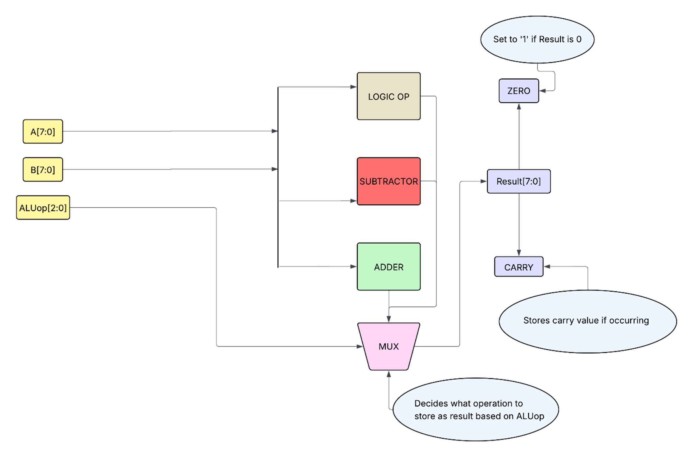
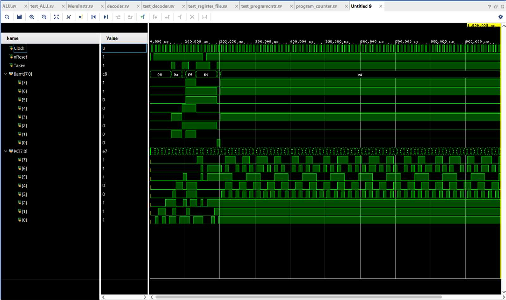
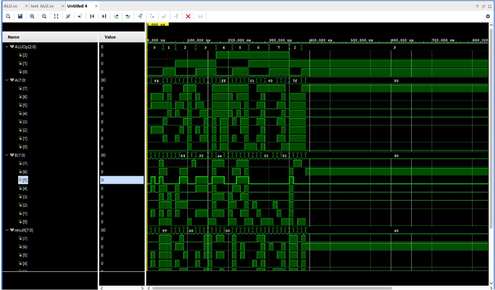
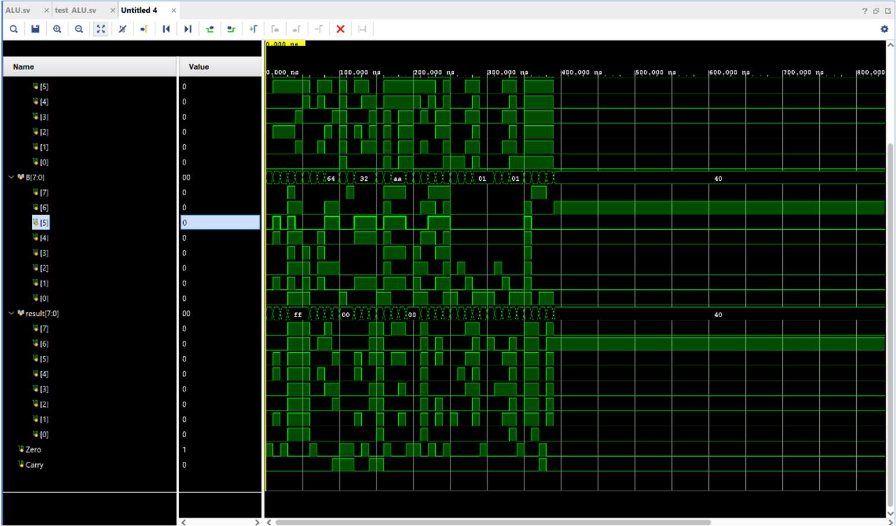
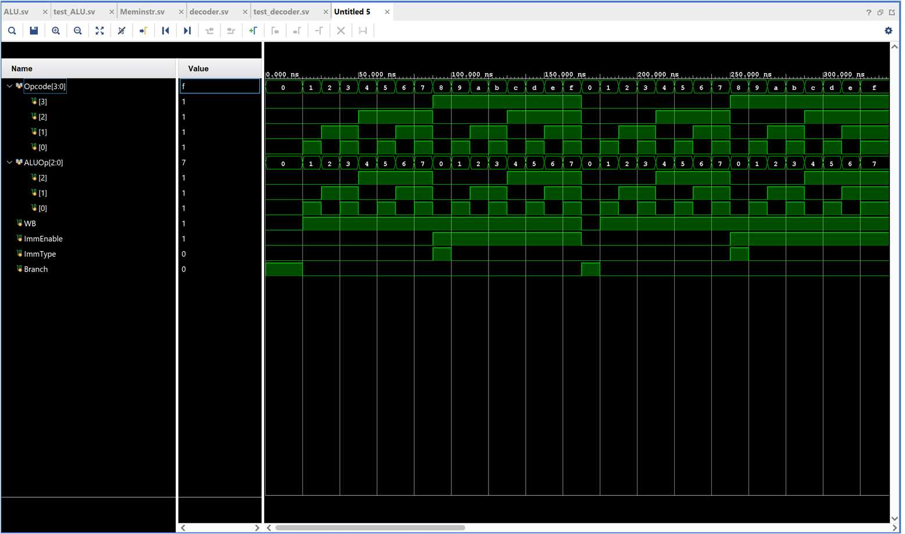
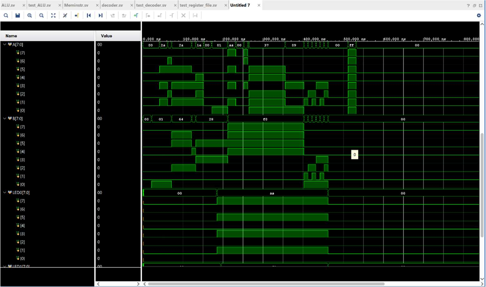
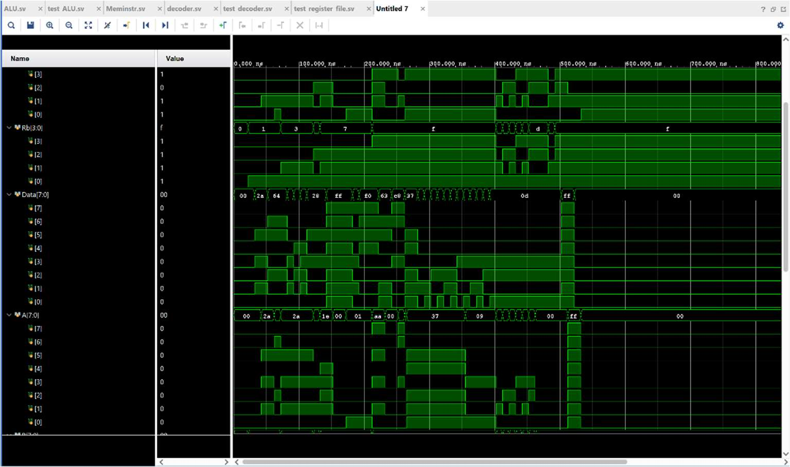
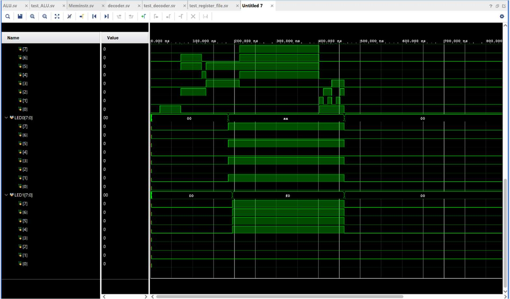

# 8-Bit RISC CPU — SystemVerilog

A custom 8-bit RISC processor designed and verified in SystemVerilog, with a 16-instruction ISA, a hand-reduced gate-level decoder, a Python assembler with label resolution, and per-module self-checking testbenches simulated in AMD Vivado.

**Highlights**

- Custom 16-instruction ISA across four encodings (R / I / L / B), 16-bit instruction word
- 16 × 8-bit register file with dual asynchronous read ports and synchronous write; `R0`/`R1` hardwired to `0`/`1`, `R14`/`R15` mapped to LED outputs
- Structural ALU: 1-bit full adder → 8-bit ripple-carry chain → add/sub top level; subtraction computed as `A + ~B + 1` to reuse the same adder hardware
- Decoder control logic minimised by hand with Karnaugh maps before implementation ([scanned working notes](docs/design-notes/))
- Signed relative branching (`PC = PC + Bamt`) supporting forward and backward jumps, with active-low synchronous reset
- 429-line Python assembler: two-pass label resolution, per-encoding immediate range checking, verbose disassembly mode

---

## Architecture

```
            +--------------------+
   PC ----> | Instruction Memory | ----> Instr[15:0]
   ^        +--------------------+            |
   |                                          v
   |  branch (signed)                   +-----------+
   +----------------------------------- |  Decoder  | --> ALUop, WB, ImmEnable, ImmType, Branch
                                        +-----------+
                                              |
                                              v
                              +---------------------------+
        write-back <--------- | Register File (16 × 8-bit)| --> A, B
                              +---------------------------+
                                              |
                                              v
                                        +-----------+
                                        |    ALU    | --> Result, Zero, Carry
                                        +-----------+
```

### ALU

Eight operations selected by a 3-bit `ALUop`. The adder and subtractor compute in parallel; a mux selects the result. Carry is captured for `add`, and inverted for `sub` (borrow). The zero flag drives `beqz`.

| ALUop | Operation   | Result        |
|-------|-------------|---------------|
| 000   | Passthrough | `B`           |
| 001   | OR          | `A \| B`      |
| 010   | ADD         | `A + B`       |
| 011   | SUB         | `A − B`       |
| 100   | AND         | `A & B`       |
| 101   | XOR         | `A ^ B`       |
| 110   | SLL         | `A << B`      |
| 111   | SRL         | `A >> B`      |



### Decoder

The 4-bit opcode is translated into five control signals. Rather than a naive case statement, each signal was reduced by hand with truth tables and Karnaugh maps to minimise gate count — e.g. `ALUop[2:0]` falls straight out of the opcode's low bits, `WB = O₀ + O₁ + O₂ + O₃` (De Morgan on the single non-writeback case), and `ImmEnable = O₃`. The full derivations are in [docs/design-notes/](docs/design-notes/).

| Signal      | Width | Function                                        |
|-------------|-------|-------------------------------------------------|
| `ALUop`     | 3     | Selects ALU operation                           |
| `WB`        | 1     | Enables register write-back                     |
| `ImmEnable` | 1     | Selects immediate over register operand         |
| `ImmType`   | 1     | `0` = I-type immediate, `1` = L-type immediate  |
| `Branch`    | 1     | Marks a branch instruction                      |

---

## Instruction Set

| Instruction | Encoding | Opcode | Operation      | | Instruction | Encoding | Opcode | Operation      |
|-------------|----------|--------|----------------|-|-------------|----------|--------|----------------|
| `beqz`      | B        | 0000   | Branch if zero | | `li`        | L        | 1000   | Load immediate |
| `or`        | R        | 0001   | A \| B         | | `ori`       | I        | 1001   | A \| imm       |
| `add`       | R        | 0010   | A + B          | | `addi`      | I        | 1010   | A + imm        |
| `sub`       | R        | 0011   | A − B          | | `subi`      | I        | 1011   | A − imm        |
| `and`       | R        | 0100   | A & B          | | `andi`      | I        | 1100   | A & imm        |
| `xor`       | R        | 0101   | A ^ B          | | `xori`      | I        | 1101   | A ^ imm        |
| `sll`       | R        | 0110   | A << B         | | `slli`      | I        | 1110   | A << imm       |
| `srl`       | R        | 0111   | A >> B         | | `srli`      | I        | 1111   | A >> imm       |

### Instruction Formats

| Format | [15:12] | [11:8]      | [7:4]  | [3:0]     |
|--------|---------|-------------|--------|-----------|
| R      | opcode  | rd          | rs1    | rs2       |
| I      | opcode  | rd          | rs1    | imm[3:0]  |
| L      | opcode  | rd          | imm[7:0]           ||
| B      | opcode  | imm[11:4] (signed)   | rs1       ||

---

## Assembler

`assembler/assembler.py` converts assembly source to hex machine code for the instruction memory ROM. It performs two-pass label resolution (forward and backward branch targets), validates immediate ranges per encoding (I-type: −8…7; L-type: 0…255), and reports errors with line numbers.

```bash
python3 assembler.py -o output.txt text.txt      # assemble
python3 assembler.py -v -o output.txt text.txt   # verbose: prints each encoded instruction
```

Example program exercising branches, immediates, and the LED registers:

```asm
li r2, 5
li r3, 6
xor r4, r3, r2
beqz r0, NEXT
li r14, 8
NEXT: beqz r4, SKIP
li r12, 8
SKIP: beqz r2, END
li r13, 4
END: beqz r0, END        ; halt via self-branch
```

---

## Verification

Every module has a dedicated testbench under `testbenches/`, simulated in AMD Vivado. Waveform captures below are from the actual simulation runs.

| Testbench                 | Coverage                                                        |
|---------------------------|-----------------------------------------------------------------|
| `test_program_counter.sv` | Reset, sequential increment, signed forward/backward branches   |
| `test_alu.sv`             | All 8 operations, carry and zero flag behaviour, edge cases     |
| `test_decoder.sv`         | All 16 opcodes against expected control-signal vectors          |
| `test_register_file.sv`   | Dual-port reads, synchronous writes, hardwired `R0`/`R1`, LED ports |

<details>
<summary><b>Program counter</b> — reset, increment, and signed branching (click to expand)</summary>


</details>

<details>
<summary><b>ALU</b> — all operations with carry/zero flags</summary>



</details>

<details>
<summary><b>Decoder</b> — control signals across all 16 opcodes</summary>


</details>

<details>
<summary><b>Register file</b> — dual-port reads, writes, and LED-mapped registers</summary>




</details>

---

## Repository Structure

```
.
├── src/                       # Synthesisable RTL
│   ├── program_counter.sv
│   ├── alu.sv
│   ├── adder_8bit.sv          # 8× daisy-chained full adders
│   ├── fullAdder.sv
│   ├── decoder.sv
│   ├── register_file.sv
│   └── instruction_memory.sv
├── testbenches/               # One self-contained testbench per module
├── assembler/
│   ├── assembler.py
│   ├── text.txt               # Example program
│   └── output.txt             # Assembled hex
├── docs/
│   ├── alu_block_diagram.png
│   ├── waveforms/             # Vivado simulation captures
│   └── design-notes/          # Scanned K-map derivations for the decoder
└── README.md
```

## Running the Simulations

1. Create a Vivado project and add `src/` as design sources and `testbenches/` as simulation sources.
2. Set the desired `test_*.sv` as the simulation top and run behavioural simulation.
3. To change the program: edit `assembler/text.txt`, re-run the assembler, and load the output into `instruction_memory.sv`.

## Tools & References

- **AMD Vivado** — simulation and synthesis
- Harris & Harris, *Digital Design and Computer Architecture* (ARM ed., 2021)
- Patterson & Hennessy, *Computer Organization and Design* (5th ed., 2017)
- IEEE Std 1800-2017 (SystemVerilog)
